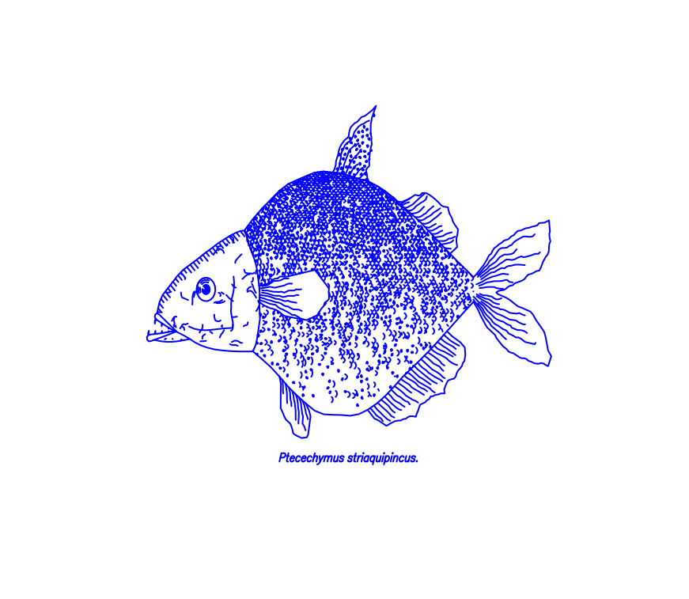
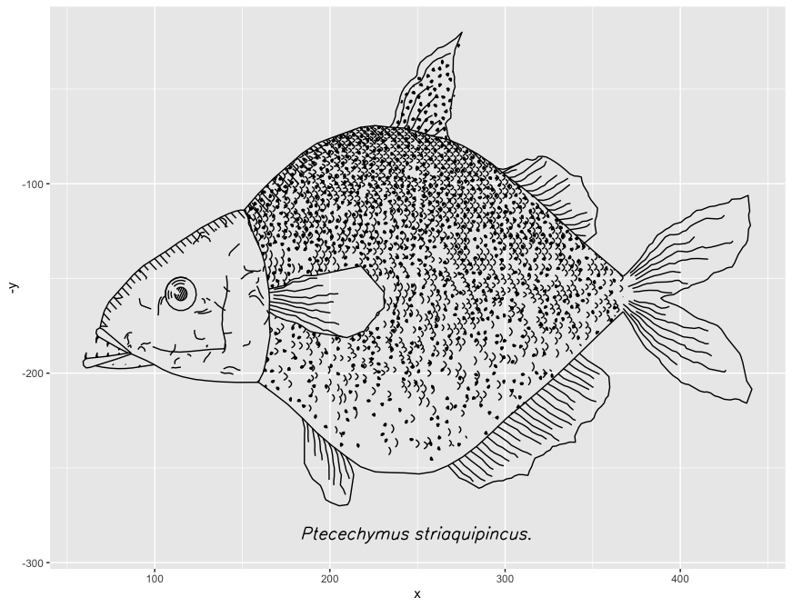
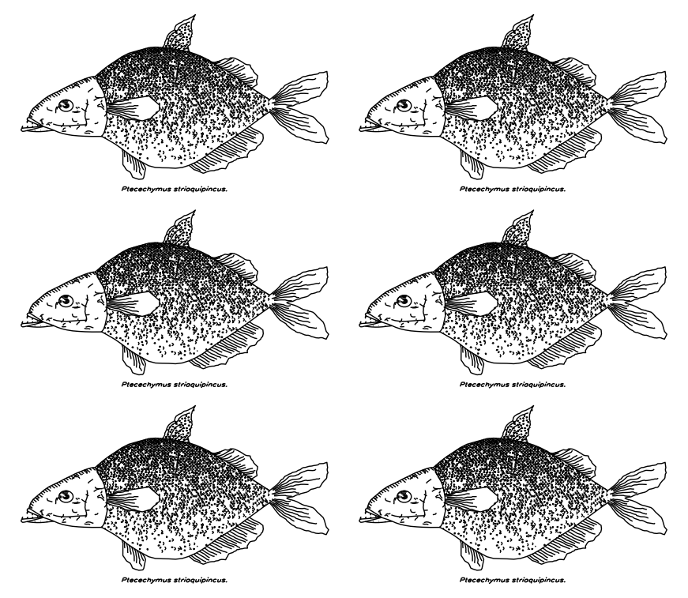

# rfishdraw
Procedurally generated fish drawings via [ggplot2](https://github.com/tidyverse/ggplot2) based on [fishdraw Javascript](https://github.com/LingDong-/fishdraw) JavaScript library. Note: You need to install [nodejs](https://nodejs.org/en/) before using the [rfishdraw](https://github.com/Otoliths/rfishdraw) package.


## :arrow_double_down: Installation

### Windows

Installing nodejs under windows from [nodejs](https://nodejs.org/en/). 

### MacOS

```
brew search node 
brew install node@14
brew link node@14
node --version
```

### Ubuntu

```
sudo apt-get install nodejs
```

### Installing rfishdraw

Install development versions from GitHub with:
```r
library(devtools)
install_github("Otoliths/rfishdraw")
```
## :beginner: Example

###### Load the **rnsii** package
```r
library("rfishdraw")
```
##### Get outputs polylines in svg
```
get_polylines(path = "inst/fishdraw.js",
              format = "smil",
              output = "animated.svg",
              draw_type = "random")
```


##### fish drawings via plot
```
file <- system.file("extdata",package = "rfishdraw")
dat <- readRDS(paste0(file,"/","output_json.rds"))
for (i in seq(length(dat))) {
dat[[i]] <- cbind(dat[[i]],i)
}
plot(NA, xlim = c(0,520),ylim = c(-320,0),axes = F,xlab = " ",ylab = " ")
for(i in seq(length(dat))) {
  lines(x = dat[[i]][,1],y = -dat[[i]][,2], lwd=2, col = "blue")
}
```


##### fish drawings via ggplot2
```
fish_draw()

```


##### fish drawings via ggplot2
```
require(ggplot2)
p1 <- fish_draw() +
  theme_void()

library(patchwork)
p1+p1+p1+p1+p1+p1+plot_layout(ncol = 2)

```



## :heart: Contribution

Contributions to this package are welcome. 
The preferred method of contribution is through a GitHub pull request. 
Feel also free to contact us by creating [**an issue**](https://github.com/Otoliths/rfishdraw/issues).
